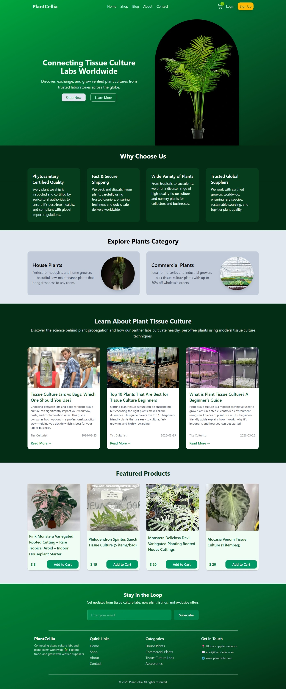
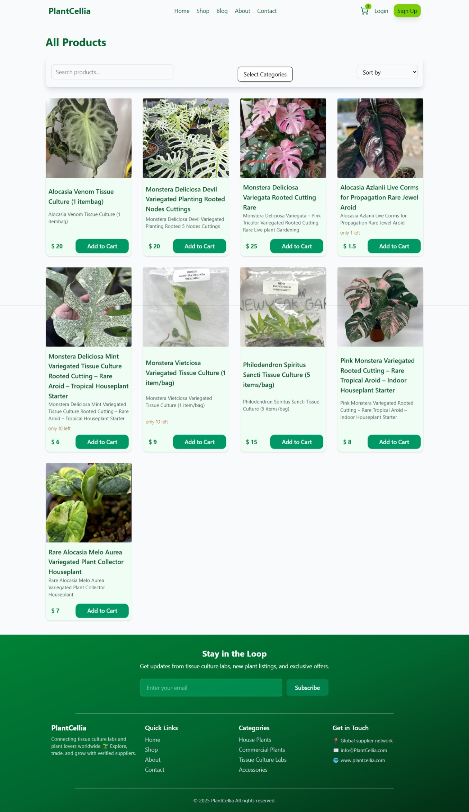
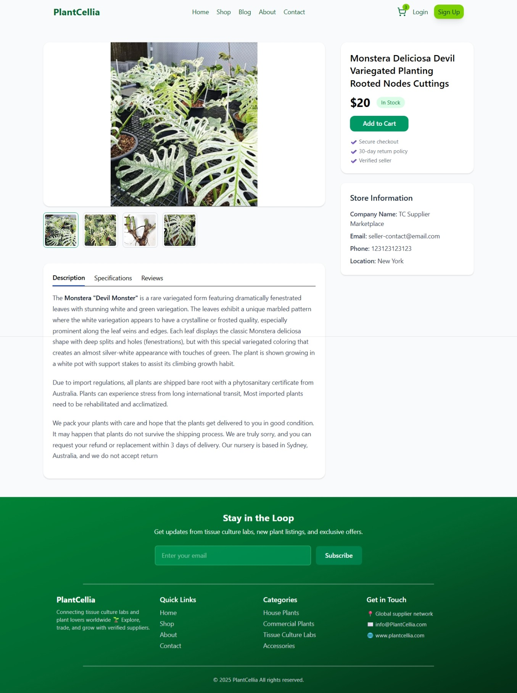
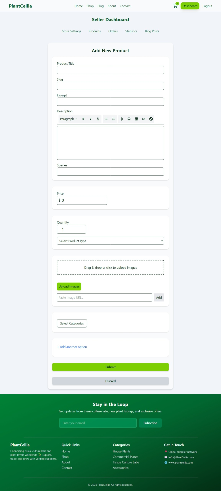
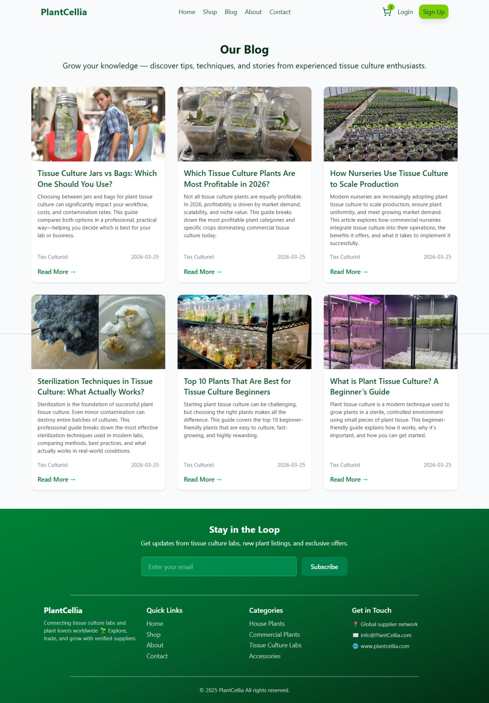
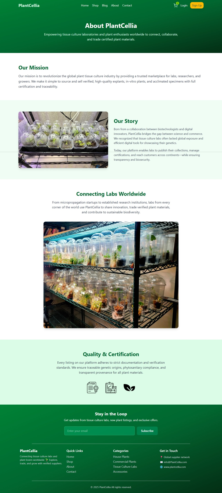
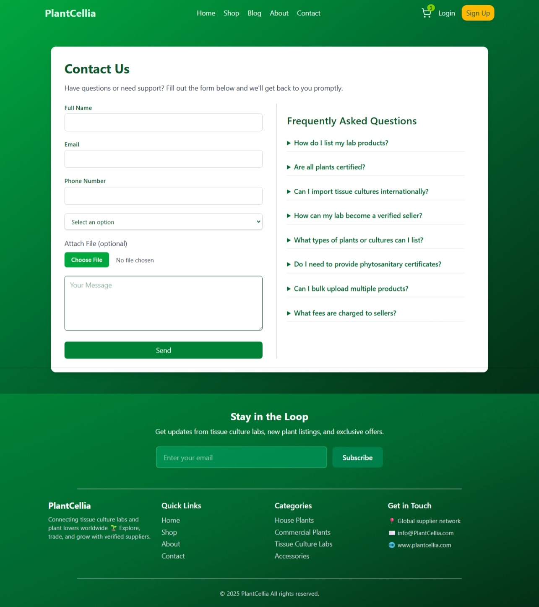
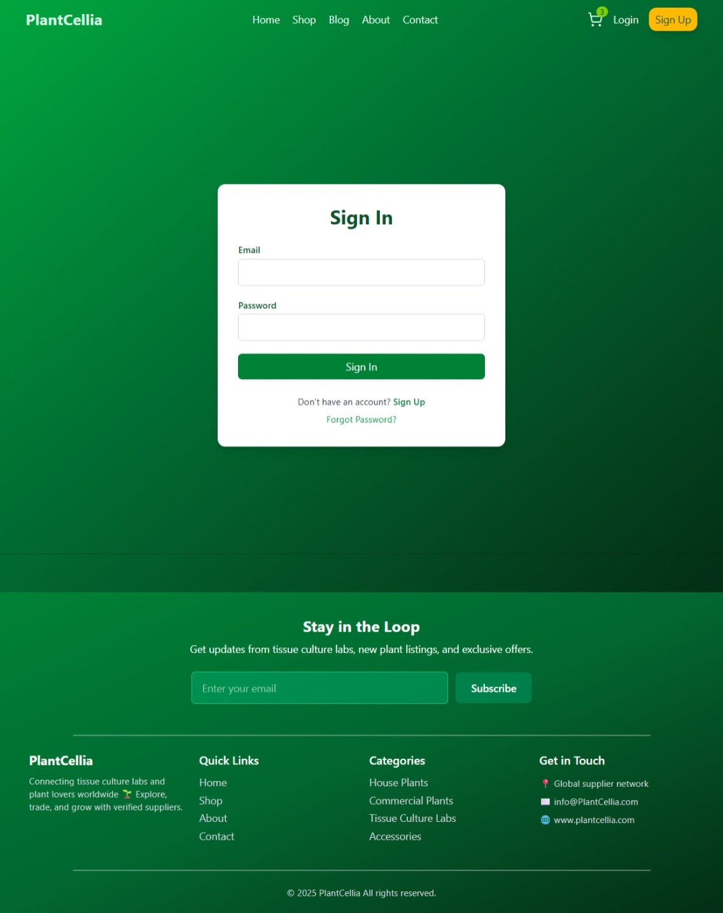
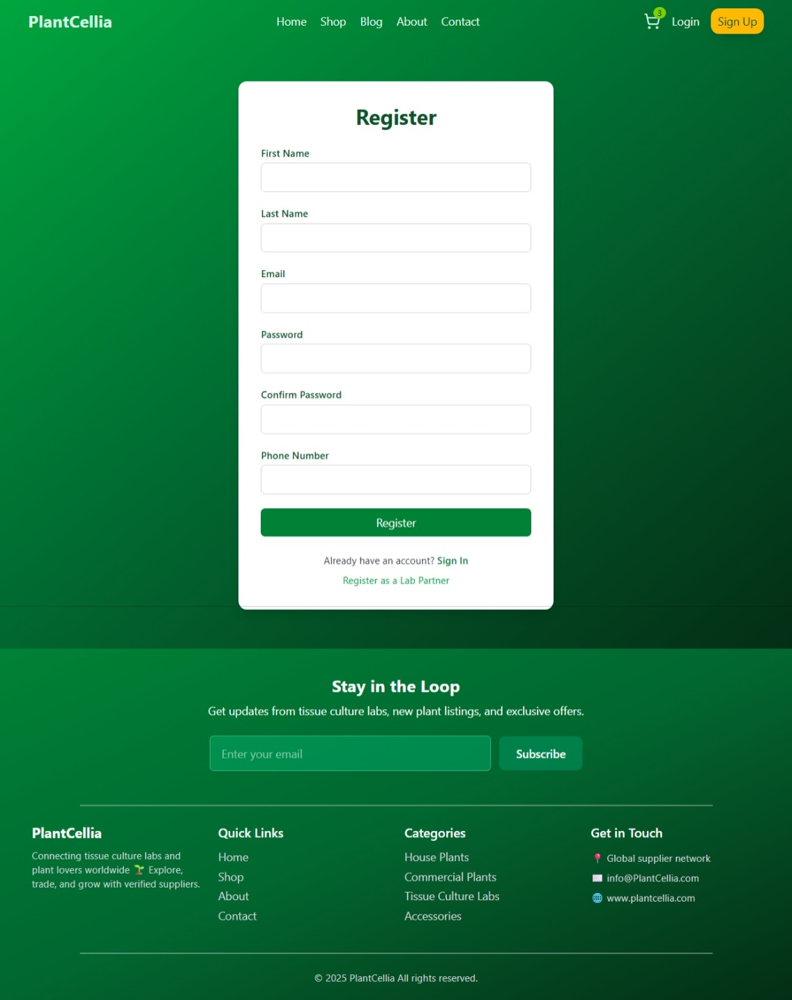
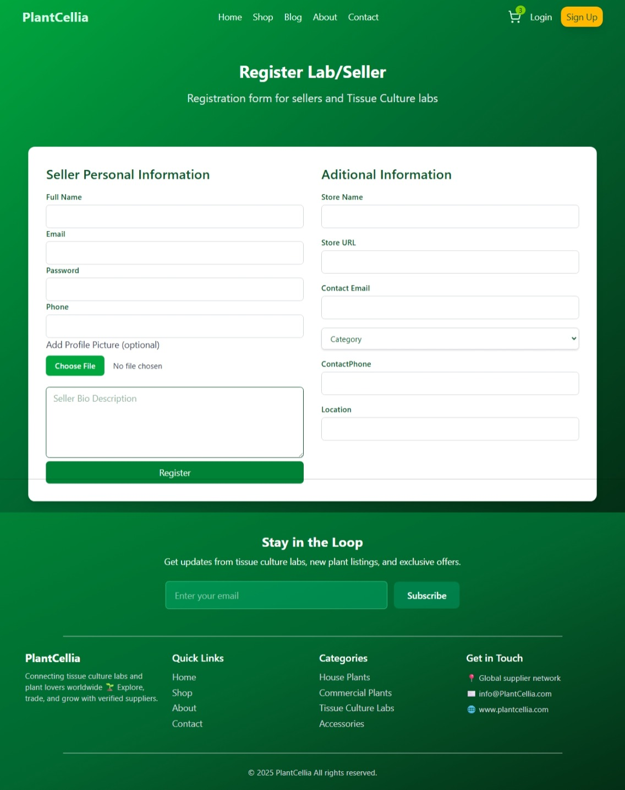

# TC Marketplace

**Overview**
- **Project:**: A full-stack marketplace prototype focused on plant genetics through tissue culture, enabling the sale of explants and related materials. It also includes an articles section on plant acclimatization and lab materials, allowing contributors to share and demonstrate their expertise. The system features a Node/Express backend (API + admin tools) and a React + Vite frontend (consumer and admin interfaces), MongoDB for the database, AWS S3 and CloudFront for image upload and serving.

Live website : http://tc-marketplace-react-frontend.s3-website-us-east-1.amazonaws.com/

**Table of contents**
- **Overview:**: Quick summary of the project
- **Features:**: What the project implements
- **Architecture:**: Folder-level layout and responsibilities
- **Backend:**: How to run and env vars
- **Frontend:**: How to run and env vars
- **Fake data & seeds:**: Where sample data lives and seed commands
- **Contributing:**: Notes for contributors

**Features**

### User Management
- **Registration and Login**: Users can register as buyers or sellers, with JWT-based authentication.
- **Role-based Access**: Supports buyer and seller roles with protected routes.
- **Profile Management**: Update user details and seller/store information.
- **User Administration**: List users, find by email, update, and delete users (admin functionality).

### Product Management
- **CRUD Operations**: Create, read, update, and delete products (seller-only for creation/update).
- **Image Integration**: Upload and manage product images using AWS S3 and CloudFront.
- **Product Variants**: Support for product variants (e.g., different sizes, colors).
- **Featured Products**: Retrieve featured products for homepage display.
- **Seller Products**: Get products listed by a specific seller.

### Store/Seller Management
- **Store Profiles**: Sellers can create and manage their store profiles with details like name, contact info, location, and description.
- **Store Listings**: Public access to view store information.
- **Product Management**: Sellers can view and manage their own products through the store interface.

### Categories
- **Category CRUD**: Create, update, delete, and list categories.
- **Category Tree**: Hierarchical category structure for better organization.

### Shopping Cart
- **Cart Operations**: Add, update, and remove items from the cart.
- **Session Management**: Cart persistence using sessions.
- **Checkout**: Complete checkout process for orders.

### Blog/Content
- **Blog Posts**: Create, read, update, and delete blog posts (seller-only for management).
- **Markdown Support**: Blog content using markdown for rich text.
- **Featured Posts**: Highlight featured blog posts.
- **Personal Posts**: Sellers can view their own blog posts.

### File Upload
- **Image Upload**: Utilities for uploading images to AWS S3.
- **Presigned URLs**: Secure upload mechanism using CloudFront presigned URLs, S3 buckets are private.

### Variants
- **Variant Management**: CRUD operations for product variants.

### Additional Modules
- **Inventory**: Model support for inventory management (implementation in progress).
- **Orders**: Order model for tracking purchases (API endpoints to be added).
- **Payment**: Placeholder for payment processing integration.

**Architecture**
- **Backend:**: [backend](backend/) — Express API, MongoDB models, modular routes located in `modules/`.
- **Frontend:**: [frontend](frontend/) — React app (Vite) in `src/` with services that call the API.

**Backend (quickstart)**
- **Install:**:

	1. `cd backend`
	2. `npm install`
	3. Edit .env file
- **Environment variables:**: Create a `.env` file (example values) :
	You can skip AWS S3 and upload images with URL instead

	- `MONGO_URI` : MongoDB connection string
	- `JWT_SECRET` : Secret for signing JWTs
	- `JWT_EXPIRES_IN` : token expiry, e.g `7d`
	- `AWS_ACCESS_KEY_ID` / `AWS_SECRET_ACCESS_KEY` : AWS credentials for S3 uploads
	- `AWS_REGION` : AWS region for the S3 bucket
	- `AWS_S3_BUCKET` : S3 bucket name used by upload utilities
	- `PORT` : (optional) server port, defaults to `5000`

	4. Run script to load category tree data
- **Seed categories:**: `npm run seed:categories` (script: [backend/scripts/seedCategories.js](backend/scripts/seedCategories.js))
	5. Populate the database with users, products, stores and blog posts. 
- **Seed data:**: `npm run seed:data` (script: [backend/scripts/seedData.js](backend/scripts/seedData.js))

- **Run (development):**: `npm run dev` (uses `nodemon`)

**Frontend (quickstart)**
- **Main files:**: [frontend/package.json](frontend/package.json), [frontend/src](frontend/src)
- **Install:**:

	1. `cd frontend`
	2. `npm install`

- **Environment variables:**: Frontend expects a Vite .env var to point to the API:

	- `VITE_API_URL` : base API URL (e.g. `http://localhost:5000/api`)

- **Run (dev):**: `npm run dev`
- **Build:**: `npm run build`

**Deployment on AWS**
- See [AWS Deployment Guide](docs/aws-deployment.md) for detailed step-by-step instructions.

**Fake data & seeds**
	- Before running make sure you load seed data, from /backend run : `npm run seed:data` , `npm run seed:categories`
	

**Notable modules & files**
- **Auth:**: `modules/auth` — registration, login, JWT utils ([backend/utils/auth.js](backend/utils/auth.js)).
- **Upload:**: `modules/upload` — S3 client and helpers; see [backend/modules/upload/upload.utils.js](backend/modules/upload/upload.utils.js) for required AWS env vars.
- **Database connection:**: [backend/config/db.js](backend/config/db.js) uses `MONGO_URI`.

**Developer notes**
- **API base path:**: Backend routes are mounted under `/api/*` (see `server.js`).
- **Logging:**: Winston logger is used under `utils/logger.js` and Morgan is available for request logs.
- **Auth:**: JWT tokens are signed with `JWT_SECRET` and consumed by middleware in `middleware/auth.js`.

**Contributing**
- **Bugs & features:**: Open an issue with reproduction steps and desired behavior.
- **Local dev flow:**: Run the backend and frontend concurrently (two terminals). Seed categories before creating category-dependent resources.

**Screenshots and gifs** 

Home Page
 

Store Page

Product Page

Seller dashboard - Add product form

Adding a product with images upload

Blog 

Blog Post

About Page

Contact Page

Login

Buyer registration

Seller Registration
